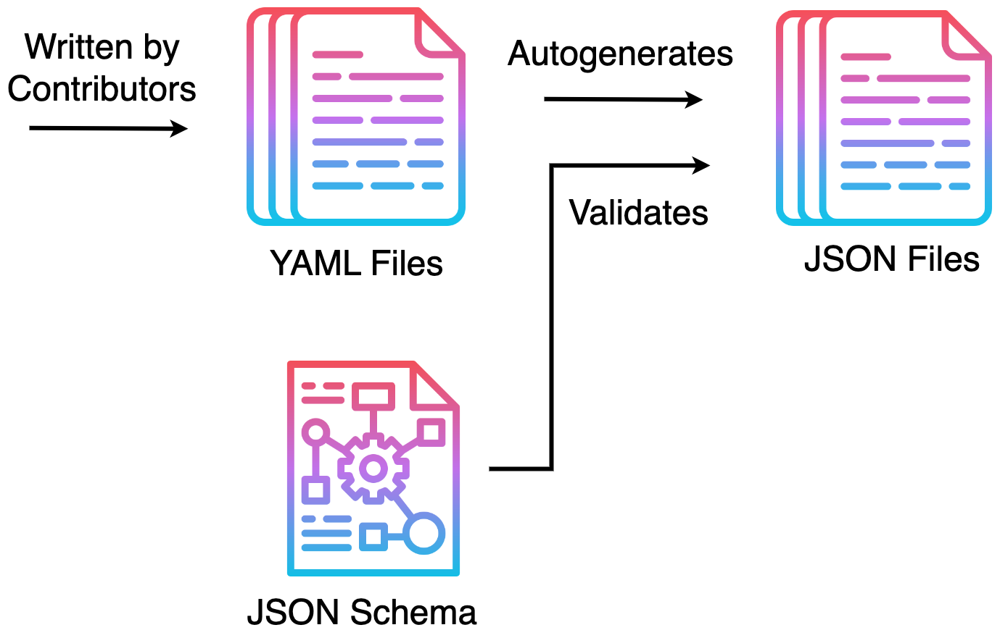

<p align="center">
  
</p>
<p align="center">
    <h1 align="center">Coptish Datastore</h1>
</p>
<p align="center">
    <em>our coptic heritage, made accessible</em>
</p>

<br/>
<p align="center">
    <!--  -->
    
    
    
</p>
<p align="center">
    
    
    
    
</p>

<br/>

## 📜 Overview

The Coptish Datastore is a repository dedicated to preserving and unifying Coptic Orthodox texts across multiple languages, including English, Arabic, Coptic, and Coptic-English. It currently houses a variety of sacred texts, such as liturgy, readings, and psalmody prayers. The texts are stored in YAML format, making it easy for contributors to add and edit content. Additionally, the YAML data is processed into JSON format, facilitating easy integration and parsing in various projects and applications.

<br/>

## ⚙️ Features

<br/>

<p align="left">
  
</p>

<br/>

<br/>

## 📦 Repository Structure

```sh
└── coptish-datastore/
    ├── .github/workflows   # github-specific actions
    ├── data                # raw yaml-data
    ├── output              # processed json-data
    ├── schemas             # json-schemas for data validation
    └── scripts             # ts-scripts for data manipulation
```

<br/>

## 🤝 Contributing

Contributions are welcome! Here are several ways you can contribute:

-   **[Report Issues](https://github.com/markrofail/coptish-datastore/issues)**: Submit bugs found or log feature requests for the `coptish-datastore` project.
-   **[Submit Pull Requests](https://github.com/markrofail/coptish-datastore/blob/main/CONTRIBUTING.md)**: Review open PRs, and submit your own PRs.
-   **[Join the Discussions](https://github.com/markrofail/coptish-datastore/discussions)**: Share your insights, provide feedback, or ask questions.

<details closed>
<summary>Contributing Guidelines</summary>

1. **Fork the Repository**: Start by forking the project repository to your github account.
2. **Clone Locally**: Clone the forked repository to your local machine using a git client.
    ```sh
    git clone https://github.com/markrofail/coptish-datastore
    ```
3. **Create a New Branch**: Always work on a new branch, giving it a descriptive name.
    ```sh
    git checkout -b new-feature-x
    ```
4. **Make Your Changes**: Develop and test your changes locally.
5. **Commit Your Changes**: Commit with a clear message describing your updates.
    ```sh
    git commit -m '[feat] new feature x.'
    ```
6. **Push to github**: Push the changes to your forked repository.
    ```sh
    git push origin new-feature-x
    ```
7. **Submit a Pull Request**: Create a PR against the original project repository. Clearly describe the changes and their motivations.
8. **Review**: Once your PR is reviewed and approved, it will be merged into the main branch. Congratulations on your contribution!
 </details>

### Contributors

<a href="https://github.com{/markrofail/coptish-datastore/}graphs/contributors">
    
</a>

<br/>

## 🎗 License

This project is protected under the [Mozilla Public License Version 2.0](https://www.mozilla.org/en-US/MPL/2.0/) License.

For more details, refer to the [LICENSE](./LICENSE) file.
